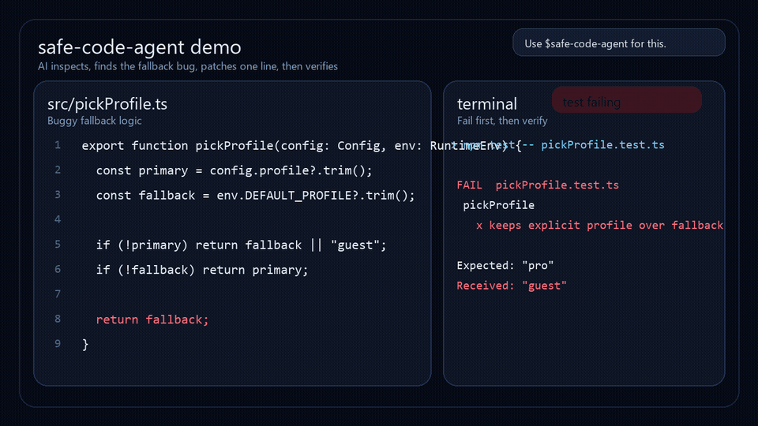

# Safe Code Agent

A coding-agent skill for safer AI code editing: inspect first, patch minimally, verify honestly.

[한국어 정리](./docs/ko-summary.md)

Safe Code Agent helps AI coding agents inspect code before editing, reduce over-editing, verify changes explicitly, and report uncertainty instead of hiding it behind polished output.

It also requires a pre-approval plan before risky implementation, real execution, broad edits, or external effects.

## Core Loop

```text
Goal -> Inspect -> Simulate -> Patch minimally -> Verify -> Report uncertainty
```

## When to Use

Use Safe Code Agent for:

- risky refactors
- multi-file changes
- verification-heavy work
- contract, fallback, schema, or precedence logic
- agentic coding workflows
- code changes where mistakes are expensive

For tiny tasks, it may feel heavier than a lightweight default prompt.

## Quick Start

1. Copy the skill into your coding-agent setup.
2. Put the lightweight defaults in your project instructions when needed.
3. Ask the agent to inspect the code before editing.
4. Require a pre-approval plan before risky actions.
5. Require it to verify changes and report uncertainty.

Example targets:

- `CLAUDE.md`
- project `AGENTS.md`
- agent system prompt
- custom coding workflow prompt

Skill files in this repo:

- `SKILL.md` (root compatibility copy)
- `skills/safe-code-agent/SKILL.md`
- `AGENTS.md`

## Not for Everything

Safe Code Agent is intentionally stricter than lightweight coding prompts.

It may feel heavy for:

- tiny scripts
- one-line edits
- throwaway experiments
- tasks where speed matters more than verification

For everyday lightweight coding, use a simpler default prompt. For risky or complex changes, use Safe Code Agent.

## Positioning

Safe Code Agent is not meant to replace every coding prompt.

It is designed for situations where safety, verification, and controlled code changes matter.

| Use Case | Recommended Strategy |
|---|---|
| Everyday coding | Karpathy-style lightweight rules |
| Risky refactors | Safe Code Agent |
| Multi-file changes | Safe Code Agent |
| Unclear requirements | Grill Me-style questioning |
| Design review before coding | Grill Me-style questioning |
| Final verification | Safe Code Agent |

## Demo

This short demo shows the intended loop: inspect the failing branch, use Safe Code Agent, patch one line, then verify with a visible test run.

[](./assets/safe-code-agent-demo.mp4)

Click the preview to open the full MP4.

## Pre-Approval Planning

When an agent is about to ask for approval, it should not ask with only a vague "proceed?" prompt.

Before approval, Safe Code Agent should state:

- the task contract
- selected mode and gates
- files or execution paths it plans to inspect
- likely change points
- what will not change
- why approval is needed
- how the result will be verified

The approval question should be specific:

```text
Approval needed: <specific action>
Scope: <files/commands/effects>
Risk: <main risk>
Verification after approval: <commands/checks>
Proceed?
```

## Why It Exists

Many coding-agent failures follow the same pattern:

- editing before understanding the goal
- changing too much
- assuming the root cause
- skipping code inspection
- claiming checks passed without visible evidence
- hiding uncertainty

Safe Code Agent exists to make those failures less likely in real coding work.

## What the Skill Enforces

- inspect relevant code before patching
- show a pre-approval plan before risky actions
- preserve local conventions and architecture
- choose the smallest safe change
- separate inferred behavior from verified behavior
- use explicit verification labels
- report remaining uncertainty honestly

## Skill Structure

```text
safe-code-agent/
|-- README.md
|-- AGENTS.md
|-- SKILL.md
|-- skills/
|   `-- safe-code-agent/
|       |-- agents/
|       |   `-- openai.yaml
|       `-- SKILL.md
|-- docs/
|   |-- ko-summary.md
|   |-- pre-approval-planning.md
|   |-- scoring-rubric.md
|   |-- stability-notes.md
|   `-- advanced/
|       |-- prototype-to-production.md
|       |-- risk-signal-router.md
|       |-- runtime-enforcement.md
|       `-- structured-hallucination.md
`-- assets/
    |-- safe-code-agent-demo.gif
    |-- safe-code-agent-demo.mp4
    `-- safe-code-agent-v022-pre-approval.png
```

## Advanced Notes

The advanced docs are optional. They are not meant to be loaded for every task.

Use them when a specific risk signal appears:

| Situation | Add this doc |
|---|---|
| Tests or build are claimed as passed but no output is visible | `docs/advanced/runtime-enforcement.md` |
| Prototype code starts becoming core logic | `docs/advanced/prototype-to-production.md` |
| The report looks polished but evidence is unclear | `docs/advanced/structured-hallucination.md` |
| Work touches auth, payment, data deletion, migration, public API, or persistence | consider `docs/advanced/runtime-enforcement.md` |

## Notes

This repository is a prompt and skill design for coding agents. It is not a runtime enforcement system or a benchmark claim.

## License

MIT
